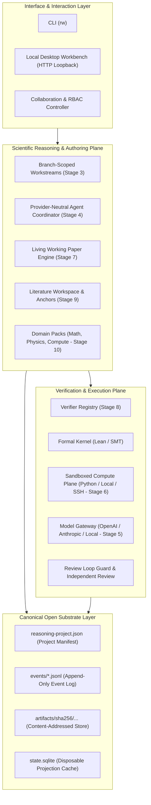
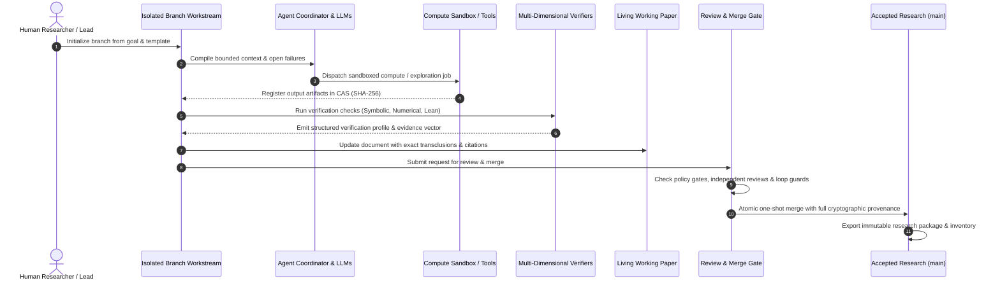
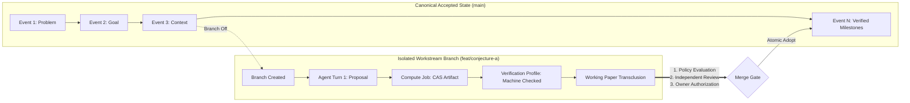

# OpenReason

[](https://www.typescriptlang.org/)
[](https://nodejs.org/)
[](https://vitest.dev/)
[](LICENSE)

**OpenReason** is an open-source, local-first scientific reasoning workbench and autonomous research platform for sustained investigations across **pure mathematics**, **theoretical physics**, and **computational sciences**.

Unlike conversational AI wrappers, OpenReason models research as an **open, event-sourced, typed reasoning graph**. Language models and compute tools operate in **isolated, branch-scoped workstreams** where proposals remain tentative until verified by multi-dimensional proof checkers, sandboxed compute engines, and independent peer review gates.

---

## Key Capabilities

- 🏛️ **Open Event-Sourced Project Format:** Human-readable JSONL history, content-addressed storage (CAS), cryptographic hash chains, and disposable SQLite projections. Completely independent of any cloud database or AI provider.
- 🌳 **Semantic Branching & Workstream Isolation:** Agents explore conjectures in isolated branches without contaminating the accepted scientific branch. Divergent edits create durable failure records instead of silent overwrite conflicts.
- 📐 **Living Working Papers (LaTeX & Markdown):** Self-updating research papers with exact transclusions, formula derivations, gap tracking, and dependency impact analysis.
- 🛡️ **Multi-Dimensional Verification Plane:** Report contracts for symbolic, numerical, physical, and literature checks, with formal kernel verification (e.g. Lean 4) reserved for machine-checked mathematical proof.
- 📚 **Literature Workspace & Grounding:** Multi-format ingestion (PDF, LaTeX, BibTeX, HTML) with stable page/section/theorem anchors, semantic search, citation grounding, and conservative novelty discovery.
- 📦 **Domain Packs & Project Templates:** Built-in packs for Pure Mathematics, Theoretical Physics, and Computational Reasoning, offering 7 turn-key research templates and end-to-end reference projects (RP-001, RP-002, RP-003).
- 🖥️ **Local Desktop Workbench UI:** Token-authenticated local HTTP loopback shell (`rw workbench`) for interactive reasoning graph exploration, living paper authoring, and literature search.
- 👥 **Research Collaboration & RBAC:** Role-based access control (`viewer`, `proposer`, `reviewer`, `maintainer`, `owner`), branch protection, signed peer reviews, and policy-gated merges.

---

## Architecture Overview



---

## Scientific Discovery Lifecycle

OpenReason enforces a disciplined scientific lifecycle from problem formulation to reproducible publication:



---

## Branch Isolation and Merge Policy



---

## Quick Start

### Requirements
- **Node.js**: `22.13.0` or newer
- **Package Manager**: `pnpm` (v11+)
- **Python**: `3.10+` (optional, for sandboxed compute jobs and Stage 0 validation)

### Installation & Verification

```bash
# Clone the repository
git clone https://github.com/ErnurX/OpenReason.git
cd OpenReason

# Install dependencies
pnpm install

# Run the complete test suite and contract validation
pnpm run check
```

`pnpm run check` runs the TypeScript build check, verifies that the checked-in JSON Schemas are current, executes all Vitest suites, and validates the Stage 0 architectural invariants.

---

## Hands-on Tour

### 1. Create a Project and Launch the Desktop Workbench

```bash
# Create an empty project
pnpm rw init /tmp/my-research --title "Nonlinear Oscillator Investigation"
pnpm rw info /tmp/my-research

# Launch the secure local desktop workbench UI
pnpm rw workbench /tmp/my-research
```

### 2. Run Built-in Reference Projects

OpenReason includes end-to-end, machine-verified reference projects:

```bash
# RP-001: Collatz tree invariant proof and polynomial bounds (Pure Math)
pnpm rw fixture rp001 /tmp/rp001-demo
pnpm rw info /tmp/rp001-demo
pnpm rw history /tmp/rp001-demo
pnpm rw verify /tmp/rp001-demo

# RP-002: Fermat-Euler quotient formal certificate
pnpm rw reference create /tmp/rp002-demo RP-002
pnpm rw reference evaluate /tmp/rp002-demo RP-002
pnpm rw research-package build /tmp/rp002-demo /tmp/rp002-export --reference RP-002
```

### 3. Literature Ingestion & Grounding

```bash
# Ingest document into CAS with page/section anchors
pnpm rw literature ingest /tmp/my-research ./paper.pdf \
  --metadata-file ./metadata.json --extracted-text-file ./paper.pages.txt

# Search grounded theorems and citations
pnpm rw literature search /tmp/my-research --query "symplectic integrator" --anchor-kind theorem

# Ground a claim against an exact literature anchor
pnpm rw literature review /tmp/my-research --source src_123 --anchor anc_456 \
  --outcome accepted --summary "Verified assumption A holds under smooth potential"
```

### 4. Author Living Working Papers

```bash
# Author structured document with live formula & figure transclusions
pnpm rw paper put /tmp/my-research --paper-file ./paper.json

# Render directly to publication-ready LaTeX or Markdown
pnpm rw paper render /tmp/my-research doc_paper_1 --format latex

# Analyze dependency impact across proofs and sections
pnpm rw paper impact /tmp/my-research doc_paper_1 --changed clm_theorem_1
```

### 5. Collaboration, Peer Review & Protected Merge

```bash
# Bootstrap human owner
pnpm rw collab bootstrap /tmp/my-research --actor usr_lead

# Add collaborator with reviewer role
pnpm rw collab member add /tmp/my-research --actor usr_lead --member usr_reviewer \
  --role reviewer --reason "Theoretical physics reviewer"

# Request independent review on a claim
pnpm rw collab request-review /tmp/my-research --actor usr_author --statement clm_energy_bound \
  --statement-version ver_1 --evidence evd_sym_1@ver_1 --summary "Proof of bounded energy drift"

# Authorize and execute merge into main
pnpm rw collab authorize-merge /tmp/my-research --actor usr_lead --subject usr_author \
  --source feat/hamiltonian --target main --reason "Passed all verification checks and peer review"
pnpm rw collab merge /tmp/my-research --actor usr_author --authorization auth_merge_1 \
  --source feat/hamiltonian --target main
```

---

## CLI Command Reference

The OpenReason CLI (`rw`) emits structured JSON by default for seamless agent scripting, and supports `--human` formatting for developer readability:

```text
Project & Workspace:
  rw init <project-dir> --title <title>
  rw info <project-dir> [--human]
  rw workbench <project-dir> [--port <port>] [--no-open]
  rw rebuild <project-dir>
  rw verify <project-dir>
  rw cleanup <project-dir> [--dry-run] [--remove-orphans]
  rw export <project-dir> <destination-dir>

Branching & Collaboration:
  rw branch create <project-dir> <name> [--from <branch-id-or-name>]
  rw branch diff <project-dir> <source> <target>
  rw branch semantic-diff <project-dir> <source> <target>
  rw branch merge <project-dir> <source> <target>
  rw collab bootstrap <project-dir> --actor <human-actor-id>
  rw collab member add <project-dir> --actor <owner-id> --member <actor-id> --role <role> --reason <text>
  rw collab request-review <project-dir> --actor <actor-id> --statement <claim-id> --statement-version <ver-id> --evidence <ids> --summary <text>
  rw collab decide-review <project-dir> --actor <reviewer-id> --review <id> --outcome <approved|rejected> --rationale <text>
  rw collab authorize-merge <project-dir> --actor <owner-id> --subject <actor-id> --source <branch> --target <branch> --reason <text>
  rw collab merge <project-dir> --actor <actor-id> --authorization <auth-id> --source <branch> --target <branch>

Graph & Reasoning State:
  rw object put <project-dir> --type <type> (--content <json> | --content-file <path>)
  rw edge add <project-dir> --type <type> --from <id> --to <id> --context <context-id>
  rw artifact add <project-dir> <file> --media-type <type> --name <name> --run-id <id> --environment-id <id>
  rw graph query <project-dir> [--object-type <type,...>] [--edge-type <type,...>]
  rw graph traverse <project-dir> --start <id,...> --direction <upstream|downstream|both>
  rw impact <project-dir> --changed <id,...>
  rw staleness <project-dir> --changed <id,...>

Verification & Review:
  rw verification list [--human]
  rw verification run <project-dir> --claim <claim-id> --context <context-id> --verifier <verifier-id> --input <json>
  rw verification packet <project-dir> --claim <claim-id> --context <context-id>
  rw verification review <project-dir> --review-file <path>
  rw verification loop <project-dir> --claim <claim-id> --context <context-id> [--enforce]
  rw verification align <project-dir> --alignment-file <path>
  rw verification recover <project-dir>

Living Working Papers:
  rw paper put <project-dir> (--paper <json> | --paper-file <path>)
  rw paper render <project-dir> <paper-id> [--format <markdown|latex>]
  rw paper inspect <project-dir> <paper-id>
  rw paper impact <project-dir> <paper-id> --changed <object-id,...>

Literature Workspace:
  rw literature ingest <project-dir> <file> [--metadata-file <path>] [--extracted-text-file <path>]
  rw literature search <project-dir> --query <text> [--mode <lexical|semantic|hybrid|citation>]
  rw literature open <project-dir> <source-id> <anchor-id>
  rw literature review <project-dir> --source <id> --anchor <id> --outcome <accepted|rejected|revised> --summary <text>
  rw literature cite <project-dir> --claim <id> --context <id> --citation-file <path>
  rw literature novelty <project-dir> --claim <id> --context <id>

Domain Packs & Reference Projects:
  rw domain packs
  rw domain show <pack-id>
  rw domain templates [--pack <pack-id>]
  rw domain conformance <pack-id>
  rw domain init <project-dir> --pack <pack-id> --template <template-id> --title <title>
  rw reference create <project-dir> <RP-001|RP-002|RP-003>
  rw reference evaluate <project-dir> <RP-001|RP-002|RP-003>
  rw research-package build <project-dir> <dest-dir> --reference <RP-001|RP-002|RP-003>

Workstreams & Agents:
  rw workstream create <project-dir> <name> --goal <goal-id> --policy-file <path> --allow-tool <tool-id,...>
  rw workstream run <project-dir> <workstream-id> --tool <tool-id> (--input <json> | --input-file <path>)
  rw agent create <project-dir> <workstream-id> (--script-file <path> | --model-config-file <path>)
  rw agent step <project-dir> <session-id> (--script-file <path> | --model-config-file <path>)
  rw agent steer <project-dir> <session-id> --instruction <text>
  rw models inspect --model-config-file <path>
  rw models route --registry-file <path> --task <task> --input-tokens <n> --output-tokens <n>
  rw execution run <project-dir> <workstream-id> --job-file <path>
```

---

## Storage Model: Canonical vs. Derived

```
📁 project-root/
├── 📄 reasoning-project.json   # Canonical manifest: schema version, project ID, acceptance root
├── 📁 events/                  # Canonical append-only event log (00000001-00000001.jsonl, ...)
├── 📁 artifacts/sha256/        # Content-addressed immutable file storage (CAS)
├── 📁 documents/               # Portable human/working papers
├── 📁 sources/                 # Ingested literature and bibtex files
├── 📁 proofs/                  # Formal proof scripts (e.g. Lean 4, Isabelle)
├── 📁 code/                    # Computational simulations, analysis scripts, benchmarks
└── 📁 .reasoning/              # DERIVED LOCAL STATE (Disposable & rebuildable)
    ├── 📄 state.sqlite         # Read-accelerated query & graph projection cache
    └── 📁 runtime/             # Ephemeral process locks & execution buffers
```

> [!IMPORTANT]
> The `.reasoning/` directory is **derived state only**. It can be safely deleted at any time and reconstructed from `events/` and `artifacts/` with `rw rebuild <project-dir>`. Canonical project data never depends on a proprietary cloud database or local SQLite file.

---

## Repository Structure

- [`packages/project-format`](packages/project-format) — Opaque IDs, UTC timestamps, canonical JSON, SHA-256 hashing, Zod schemas, event builders, and Draft 2020-12 JSON Schema generation.
- [`packages/store`](packages/store) — Event-sourced storage, CAS, SQLite projection, graph reasoning, completion policies, agent coordinator, model gateway, execution plane, living papers, verifiers, literature workspace, domain packs, and reference packages.
- [`packages/workbench`](packages/workbench) — Secure local HTTP loopback shell and desktop web UI for interactive reasoning and paper editing.
- [`packages/cli`](packages/cli) — The `rw` command-line interface with modular command handlers and `--human` formatters.
- [`docs/product`](docs/product) — Product contract and complete Definition of Done.
- [`docs/architecture`](docs/architecture) — System invariants, format contract, and Architecture Decision Records (ADRs 0001–0017).
- [`docs/reference-projects`](docs/reference-projects) — Formal specifications of reference research projects (RP-001, RP-002, RP-003).
- [`docs/roadmap`](docs/roadmap) — Exit criteria, acceptance tests, and stage milestone documentation (Stages 0–12).

---

## Documentation & Architecture Decision Records

- [Product Contract](docs/product/product-contract.md)
- [Complete Definition of Done](docs/product/definition-of-done.md)
- [Core System Invariants](docs/architecture/invariants.md)
- [Project Format Specification](docs/architecture/project-format-v0.md)
- [Architecture Decision Records (ADRs)](docs/architecture/adr/README.md)
- [Reference Projects Suite](docs/reference-projects/README.md)
- **Stage Exit Milestones:**
  - [Stage 0: Invariant Substrate](docs/roadmap/stage-0-exit.md)
  - [Stage 1: Event Log & CAS](docs/roadmap/stage-1-exit.md)
  - [Stage 2: Reasoning Services & Safe Merges](docs/roadmap/stage-2-exit.md)
  - [Stage 3: Typed Workstream Runtime](docs/roadmap/stage-3-exit.md)
  - [Stage 4: Provider-Neutral Agent Coordinator](docs/roadmap/stage-4-exit.md)
  - [Stage 5: Live Model Gateway & Accounting](docs/roadmap/stage-5-exit.md)
  - [Stage 6: Sandboxed Execution Plane](docs/roadmap/stage-6-exit.md)
  - [Stage 7: Living Working Papers](docs/roadmap/stage-7-exit.md)
  - [Stage 8: Multi-Dimensional Verification Plane](docs/roadmap/stage-8-exit.md)
  - [Stage 9: Literature Workspace & Grounding](docs/roadmap/stage-9-exit.md)
  - [Stage 10: Domain Packs & Reference Research Packages](docs/roadmap/stage-10-exit.md)
  - [Stage 11: Collaboration & RBAC](docs/roadmap/stage-11-exit.md)

---

## License

MIT © OpenReason Contributors.
